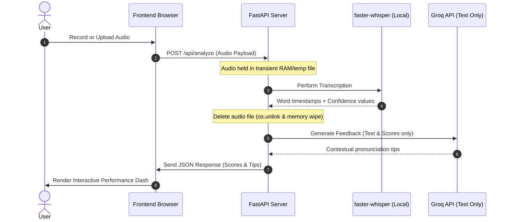

# FluentIQ — System Architecture & Design

## 1. Executive Summary
FluentIQ is an AI-powered pronunciation assessment platform that evaluates English voice recordings. It is designed to run with minimal resources while adhering strictly to contemporary privacy standards, such as India's Digital Personal Data Protection (DPDP) Act. By combining on-server, open-source speech recognition (`faster-whisper`) with low-latency LLM inference via Groq, FluentIQ delivers word-level accent analysis and actionable pronunciation tips without persisting user audio.

## 2. System Topology

```mermaid
graph TD
    %% Styling
    classDef frontend fill:#eff6ff,stroke:#3b82f6,stroke-width:1px,color:#1e3a8a;
    classDef backend fill:#f0fdf4,stroke:#22c55e,stroke-width:1px,color:#14532d;
    classDef external fill:#faf5ff,stroke:#a855f7,stroke-width:1px,color:#581c87;

    %% Nodes
    subgraph Browser ["Frontend (Client Browser)"]
        UI["User Interface"]
        Record["MediaRecorder API"]
        Uploader["Audio File Uploader"]
        Consent["DPDP Consent Modal"]
        Results["Interactive Results View"]
    end

    subgraph Server ["FastAPI Backend (Render Hosting)"]
        API["API Endpoints"]
        Pipeline["Analysis Pipeline"]
        Whisper["faster-whisper Engine"]
        Scoring["Scoring Engine"]
        Phoneme["CMU Pronouncing Dictionary"]
    end

    subgraph APIs ["Third-Party APIs"]
        Groq["Groq Llama 3.3 70B"]
    end

    %% Relations
    Consent -->|User Accepts| UI
    Record -->|Blob| UI
    Uploader -->|File| UI
    UI -->|POST /api/analyze (Audio)| API
    API --> Pipeline
    Pipeline -->|Audio File| Whisper
    Whisper -->|Tokens & Probabilities| Scoring
    Scoring -->|Under-performing Words| Phoneme
    Phoneme -->|Target Phonemes| Pipeline
    Pipeline -->|Text & Scores (No Audio)| Groq
    Groq -->|Feedback Tips| Pipeline
    Pipeline -->|JSON Payload| Results
    
    %% Assign classes
    class UI,Record,Uploader,Consent,Results frontend;
    class API,Pipeline,Whisper,Scoring,Phoneme backend;
    class Groq external;
```

## 3. Component Breakdown

### Client Browser (Frontend)
- **Consent Gatekeeping:** A blocking modal that prevents application usage until the DPDP compliance notice is acknowledged.
- **Audio Capture & Validation:** Utilizes the HTML5 `MediaRecorder` API to capture speech directly. It enforces a strict client-side limit of 45 seconds to optimize payload size and processing latency.
- **Visual Analytics:** Features custom SVG meters, color-coded word highlights, and hover-triggered pronunciation tooltips powered by GSAP for clean transitions.

### Application Server (Backend)
- **FastAPI Web Service:** Handles static file routing, CORS, and coordinates the analysis pipeline.
- **Validation Layer:** Enforces server-side constraints (audio duration between 30–45 seconds, payload size $\le$ 10 MB).
- **Orchestrated Analysis Pipeline:** Directs the execution flow:
  1. Temporary audio decoding via `pydub`.
  2. Transcription using `faster-whisper`.
  3. Probability-to-score normalization.
  4. Phoneme comparison using the CMU Pronouncing Dictionary.
  5. Feedback compilation using Llama 3.3.
  6. Final memory/disk cleanup.

### Downstream Integrations
- **Groq Llama 3.3 70B:** Contextualizes word mispronunciations by detailing the standard IPA target, expected mouth position, and common pitfalls. Only textual metadata (transcripts and scoring indices) is sent, safeguarding voice privacy.

---

## 4. Technical Stack Rationale

| Component | Choice | Rationale |
|---|---|---|
| **STT Engine** | `faster-whisper` (CTranslate2 quantised base) | Offers 4x inference speedup compared to standard OpenAI `whisper` python package. Runs fully on CPU, enabling cost-effective hosting without GPU requirements. |
| **Phonetics Dictionary** | CMU Pronouncing Dictionary | Fully local lookup dictionary. Eliminates latency and external API costs for phoneme targets. |
| **Feedback Engine** | Groq (Llama 3.3 70B Versatile) | Sub-second JSON generation (~500 tokens/sec), ensuring immediate UX feedback loop. |
| **Hosting & Deployment** | Render + Docker | Automated Docker-based container builds. Direct deploy from Git push. |

---

## 5. Scoring & Assessment Methodology

### Word-Level Confidence Mapping
FastAPI captures the individual token confidence output from `faster-whisper`. Since confidence is highly non-linear, we normalize it to a 0–100 scale:

| Whisper Confidence | Score Range | Evaluation | Visual Guide |
|---|---|---|---|
| $\ge 0.95$ | 95–100 | Good | 🟢 |
| $0.85$ – $0.95$ | 80–95 | Good | 🟢 |
| $0.70$ – $0.85$ | 60–80 | Fair | 🟡 |
| $0.50$ – $0.70$ | 40–60 | Fair | 🟡 |
| $< 0.50$ | 0–40 | Poor | 🔴 |

### Aggregated Performance Metrics
- **Pronunciation Accuracy (60%):** Weighted average of individual word confidence scores.
- **Speech Fluency (20%):** Assessed dynamically by analyzing silent gaps between word timestamps. Gaps between $0.1$s and $0.4$s are considered natural, while extended silence decreases this metric.
- **Completeness (20%):** Ratio of successfully pronounced words (score $\ge 80$) to total words.

---

## 6. Privacy & DPDP Compliance



The Digital Personal Data Protection Act (DPDP) 2023 sets high standards for processing personal voice data. FluentIQ is designed as a **zero-retention** system:

| DPDP Principle | Implementation Details |
|---|---|
| **Explicit Consent (§4–6)** | The user must actively click to accept the DPDP notice before using the recording or upload interface. |
| **Data Minimization (§4(2))** | No user creation, accounts, or persistent identifiers (cookies, tracking IDs) are stored. |
| **Transient Storage (§8)** | Voice recording is stored strictly in ephemeral system RAM (as temporary bytes) or as a local temporary file for `faster-whisper`. As soon as transcription finishes, the file is unlinked (`os.unlink()`), garbage collected, and deleted from RAM. |
| **Purpose Limitation (§5)** | Voice data is strictly analyzed to calculate scores and is never written to disk, sent to external APIs (except text prompts to Groq), or used for training. |
| **Data Residency** | The host container processes audio locally. No audio metadata leaves the server. |

---

## 7. Product Limitations & Roadmap

### Existing Trade-offs
- **CPU Inference Latency:** Running Whisper on Render's CPU container takes ~10-15s for a 40s recording. This saves hosting costs but affects instantaneous feedback.
- **Reference-Free Scoring:** Without a predefined script, the system relies on absolute transcription confidence. Mispronunciations that map to other real English words may occasionally be missed.

### Future Enhancements
1. **Reference-Aligned Assessment:** Allow reading from a chosen prompt and align user audio with target transcripts using Dynamic Time Warping (DTW) for phoneme-level match verification.
2. **GPU Acceleration:** Migrate server pipelines to Fly.io GPUs or Modal to achieve sub-2s responses.
3. **Advanced IPA Visualizations:** Display custom IPA character charts highlighting specifically mispronounced phonemes in the browser.
4. **Local Audio Encryption:** Encrypt temporary files in-transit during pipeline execution to prevent exposure in multi-tenant cloud environments.
